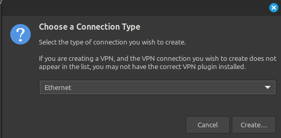

# Introduction 

<div style="text-align: justify">
This repository aims to help you build a budget-friendly home lab for learning Kubernetes and help starting local container development. It provides a simple, setup that mimics a real-world environment, making it easy to move your projects to a production Kubernetes cluster later. Key features include load balancing, support for stateful applications by enabling the use of permanent volumes, SSL certificates, and a basic container image registry. All designed to run smoothly on modest hardware without requiring complex automation or virtualization tools which may have their own learning curve addition to Kubernetes. The focus is on core Kubernetes functionality on minimal infrastructure and keeping costs to the minimum.
<br><br>
An older PC with one of the previous generation CPUs and DDR 4 RAM should be able to run this lab environment.
</div>

### Minimum and recommended configuration.
- 6 Core processor, 12 recommended
- 32 GB RAM, 64 GB recommended

# Prerequisites

### Network router or firewall 
This solution requires a network router or firewall present on the network capable of providing the following essential services: DHCP with static IP address mapping (reservations or MAC binding), virtual IP (VIP) support, local DNS resolution with the ability to define custom host A records and aliases, and load balancing functionality. While this solution has been tested with OPNsense utilizing Unbound DNS and HAProxy for some of these services, it is anticipated that other router/firewall software offering equivalent features, such as pfSense or Sophos Firewall Home Edition, should also be compatible. \

It is possible to host your firewall / router software on a virtual machine that is independent of your physical network or even only available within your virtualization environment. It is however outside of the scope of this repository.

### Host operating system is Linux
Scripts in this repository are for Linux operating system. The scripts and software install instructions were tested on Linux Mint 21.1, but any Debian or Ubuntu based system should be compatible.

### QEMU/KVM virtualization 
The virtualization platform is QEMU/KVM. It is usually shipped with mainstream Linux distributions.

# Deploy the K3s home lab
Some of these steps might be different based on the choice of your Linux distribution. It is a best practice to install local tools and other software using your Linux distribution's native package manager to keep these tools up-to-date and avoid vulnerabilities.

### Set up networking for virtualization
This solution is using Network Manager. Start the configuration by opening Network Connections. You can do it from the task bar or from the Menu.


Then add a new network connection (use the + sign).


Select "Bridge" for connection type and create.

 

Give it a friendly name like "Bridged Connection 1" and a name for the "Interface name" (like "bridge0") which you will use later in your VM configuration, so make a note of the `Interface name`. Then click "Add" to select the network interface you want to use. 


Select "Ethernet" for connection type. 

 

Select your physical network card as device , leave others default, then save it. This is usually your wired network card. \
Note: Selecting a wireless interface may not work for bridged connection. As of 2025.04 there were issues with it, which might be chipset related on my system.

 

Then save the connection too and reboot your system.

 

After reboot wait about 2-5 minutes after login, then start the network connections application again and you should see similar like the following and have a working connection.


__Note:__ This will cause the network to start slower after reboot on the machine compared not having a bridged connection set up on it, but there should not be any other impact.\
You can check the ip address of your system by running the `ip a` command. You should see the IP address for the `bridge0` interface.


### Install packages 
To simplify installations and script execution, set up the local `sudo` to allow your user to run commands with `sudo` without password prompt. You also need a few packages for QEMU and `uuid` that we need later in our installation, see scripts for `DISKUUID` variable. Replace the `<YOUR USER NAME>` with your user name.

Run the following commands: \
  If sudo is already installed then use `sudo su -` otherwise `su -` and enter the root password you set up at install time.
  ```
  apt update
  apt install -y sudo uuid qemu-system-x86 qemu-kvm bridge-utils libvirt-daemon libvirt-daemon-system virtinst libvirt-clients libguestfs-tools virt-manager 
  echo "<YOUR USER NAME> ALL=(ALL:ALL) NOPASSWD:ALL" | sudo tee /etc/sudoers.d/k3slab
  sudo usermod -aG kvm,libvirt <YOUR USER NAME>
  sudo systemctl start libvirtd
  sudo systemctl enable libvirtd
  ```

Reboot the computer and then check libvirt daemon status.
`sudo systemctl status libvirtd`

You should see similar message like this:
``` 
● libvirtd.service - libvirt legacy monolithic daemon
     Loaded: loaded (/usr/lib/systemd/system/libvirtd.service; enabled; preset: enabled)
     Active: active (running) since Fri 2025-04-25 10:08:55 EDT; 35min ago
TriggeredBy: ● libvirtd-admin.socket
             ● libvirtd-ro.socket
             ● libvirtd.socket
       Docs: man:libvirtd(8)
             https://libvirt.org/
   Main PID: 12155 (libvirtd)
      Tasks: 22 (limit: 32768)
     Memory: 31.6M (peak: 33.1M)
        CPU: 983ms
     CGroup: /system.slice/libvirtd.service
             ├─ 1548 /usr/sbin/dnsmasq --conf-file=/var/lib/libvirt/dnsmasq/default.conf --leasefile-ro --dhcp-script=/usr/lib/libvirt/libvirt_leaseshelper
             ├─ 1549 /usr/sbin/dnsmasq --conf-file=/var/lib/libvirt/dnsmasq/default.conf --leasefile-ro --dhcp-script=/usr/lib/libvirt/libvirt_leaseshelper
             └─12155 /usr/sbin/libvirtd --timeout 120
```

### Install `kubectl`
Follow steps to install `kubectl` as described on: https://kubernetes.io/docs/tasks/tools/install-kubectl-linux/#install-using-native-package-management \
Select the instructions for the Linux distribution you use.

### Install Helm
Follow steps to install Helm as described on https://helm.sh/docs/intro/install/#from-apt-debianubuntu \
Select the instructions for the Linux distribution you use.

### Install K9S

K9s is a lightweight but powerful character based user interface to manage Kubernetes clusters.
You can install it following the instruction at https://k9scli.io/topics/install/

Or download the binary from https://github.com/derailed/k9s/releases and install the executable manually.

Unfortunately this tool is not included in Linux distribution repositories.

# Set up network router / firewall
This solution assumes that the VMs have their own dedicated static IP addresses and hostnames. This way we do not have to worry about the IP addresses changing when the VMs are restarted. 

The router / firewall should be configured to provide the following services:
1. DHCP with static IP address mapping (reservations or MAC binding).\
  If you are planning to use your network's DHCP server to assign IP addresses to the VMs, then you need to make sure that the DHCP server is configured to provide static IP addresses for the VMs. This can be done by creating a DHCP reservation for each VM based on its MAC address. The MAC, IP address, and hostnames of each VM can be found in the `configuration.sh` file.\
\
\
2. Virtual IP (VIP) support.\
  This solution uses a Virtual IP (VIP) to provide a single IP address for the K3s cluster. This VIP will be used to create an A record for the K3s cluster DNS name and aliases for the services running on the K3s cluster. This will be the IP address you will access the K3s Control Plane nodes and the workloads on the cluster through aliases. 
  Later the HAProxy load balancer will bind to this VIP address and distribute the traffic to the K3s Control Plane and Agent nodes. The VIP should be configured to be accessible from your local network on your LAN interface, so that you can access the K3s cluster from your local network.\
  
3. Local DNS resolution with the ability to define custom host A records and aliases.\
  In your DNS server (Unbound in this example) you need to create a new A record for the K3s cluster. This A record should point to the VIP address you configured earlier. You can also create aliases for the services running on the K3s cluster. This will allow you to access the services using friendly names instead of IP addresses.\
  
4. Load balancing functionality (HAProxy).
  This solution uses HAProxy to load balance the traffic to the K3s Control Plane and Agent nodes. The HAProxy service should be configured to start automatically on boot of the firewall/router. A sample configuration file is provided in the `haproxy` folder. You will need to update the hostnames in it to match the hostnames you configured in the `configuration.sh` file.\
  You can manually add the backend and frontend definitions by:\
  4.1. Adding the K3s node host names to the "Real Servers" section. Specify port 6443 for the control plane (Server) nodes and leave the port empty for the Agent nodes.\
  \
  4.2. In the Virtual Servers/Backend Pools section create a backend pool for your control plane nodes and add the control plane nodes to the list of servers name it accordingly like K3sLabServers. Do the same for the Agent nodes like K3sLabAgents. Select TCP (Layeer 4) for the Mode and Round Robin for Balabcing algorithm, then add your servers to the Servers list. \
  \
  \
  4.3. In the Virtual Servers/Public Services section create a new public services for the K3s cluster Server and Agents. \
    4.3.1. For the Server nodes select the backend pool you created in the previous step and set the port to 6443.\
    \
    4.3.2. For the Agent nodes select the backend pool you created in the previous step and set the port to 80 and 433. \
    Later you might add other ports if you run databases like Postgres and need the 5243 port for it (this is not the part of this exercise). \
    \
  4.4. In the Health Monitors section you can create a rule for the Servers using port 6443 and port 10520 for the Agent nodes. This is not required but it will help you to monitor the health of the nodes and allow the load balancer to exclude nodes that are not healthy. You can assign these rules to backend pools.

# Deploy the K3s Kubernetes cluster

It is recommended to inspect the scripts and fully understand what each script does to fully understand the steps and how the environment is built up.

## Build the template VM image
To create the virtual machines for the K3s cluster this solution is using a "template" image that has a basic Linux system installed. This solution is using Debian 12 as guest operating system.

You can use the defaults offered by the installer for most of the options during the install.

### The exceptions to the defaults:

The name and hostname of this template install is `lab-k3s-template` and we use it as the file name also for the VM storage `lab-k3s-template.qcow2`. You may change it and update the `configuration.sh` file accordingly. This solution uses a user named `developer` on the VM machines for non-root login.

Make sure to select "yes" for the "Writhe changes to disk" on the "Partition  disks" screen at the end of partitioning during install. Feel free to use the defaults offered otherwise. The install scripts will turn off swapping on the K3s nodes when cloning the VMs.


Select `SSH server` for installation. It will be used for node management during install. This solution does not need any graphical interface, so you can uncheck those components (like the "Debian desktop environment" or "GNOME"). This will save you some space and result in less packages to maintain on the K3s VM nodes.


Select the device `/dev/vda` (likely you will have the same name) to install the boot loader. 


After the install, the template VM will restart. You should have the new VM template virtual machine shown in your Virtual Machine Manage application. It is important to shut it down properly before continuing with the K3s install steps and cloning the template to build the K3s VM nodes. Ensure that it is in `Shutoff` state. Regular "Shut Down" from the Virtual Machine Manager application should work. Do not use the "Force Off" option as it can leave the filesystem on the VM in a state that it requires crash recovery and may cause issues during cloning.


## Update configuration

Set up the lab configuration in the `configuration.sh` file for your needs.

While you can leave the majority of the values to their defaults, there are a few that you need to make sure are compatible with your environment of your home and local network configuration.

### Configure the server nodes

Update the K3s Server and Agent node hosts' `hosntame`, `IP address` and `MAC address` settings. Check you router / firewall if any of the hosntames, IP addresses or MAC addresses are already taken and update them to avoid collision.

The following variables control the K3s Server nodes: `K3SSERVERHOSTS`, `K3SSERVERIPS`, `K3SSERVERIMACS`.
And the `K3SAGENTHOSTS`, `K3SAGENTIPS`, and `K3SAGENTMACS` control the settings for the K3s Agent nodes.

The IP addresses of the nodes need to be static and therefore can not be in the range of the DHCP server's active range.

The domain name part of the `K3SCLUSTERFQDN` variable must match your local network's domain name.

The `K3SCLUSTERIP` variable must match the Virtual IP (VIP) configuration for your K3s lab on your network. This is the IP address you will access the K3s Control Plane nodes and the workloads on the cluster through aliases.

The `VMTEMPLATEFILE` `VMIMAGEFOLDER` variables need to match where the file and the folder are located on the local machine.

Read throught the `configuration.sh` file and update the values to match your environment. The default values should work for most home networks. Get familiar with the variables and their role in the configuration. The script will use these values to configure the K3s cluster and the VMs.

## Build the VMs
To build the virtual machines start a shell (like bash). Switch to the `buildnodes` directory and run the `buildnodes.sh` as root. This is the only command that needs to run as root on the machine hosting the VMs. This script will clone the template VM image, sysprep it for the actual nodes and then add them to the registered VMS in QUEMU. It creates an SSH key file that later will be used to remotely install K3s on the nodes.

`clear; sudo ./buildnodes.sh`

## Deploying K3s on the VMs
To deploy K3 servers and agents switch to the `deployk3` folder and run the `deployk3s.sh` script as regular user. 

`./deployk3s.sh`

## Cert Manager
The cert-manager tool takes care of managing certificates for your workloads. It provides automated certificate management for your ingress controllers and can be used to issue certificates for Gateway API endpoints. K3s' is using Traefik by default which already supports HTTP and HTTPS Gateway API endpoints.

To install cert-manager on your cluster run the `deploy.sh` from the `cert-manager` folder.
 Wait a 3-5 minutes monitor cert manager and Traefik pods restart before continuing.

Once it is successfully deployed you need top import the `*-ca.crt` file to your browser to be able to access the workloads you will deploy. Browsers are not using the Operating System's CA certificate store that the script automatically updates.

If your development machine is different than the one you use to install K3s, then you need to import the new CA certificate to that machine and to the browser(s) you use there.
For Windows see: https://learn.microsoft.com/en-us/skype-sdk/sdn/articles/installing-the-trusted-root-certificate

## Longhorn
Longhorn will provide a easy way to deploy workloads like `stateful sets` that need permanent volumes like the `image registry` and `pgadmin4` you will deploy later. This way you can develop solutions that need to store data or other files using standard Kuberentes Permanent Volumes you otherwise would use in a non-lab environment.

You must update the `values-custom.yaml` file and set the proper Fully Qualified Domain Name (FQDN) to access Longhorn management user interface. It needs to match what alias you set up earlier for it.

Then, to install Longhorn run the `deploy.sh` script from the `longhorn` folder as regular user.

Wait 3-5 minutes for all the pods to start, there will be a lot of csi-* pods running when it is done. You can check the Longhorn UI and see if every volume is healthy.

## Image registry
To deploy your custom workloads - the applications you will develop locally - you need a container image registry that can hold those application images. While you can configure your local Docker instance to do it or use docker.io, this solution provides a local self-hosted solution and a basic UI. This way you do not rely on any external image registry.

You must update the `values-custom.yaml` file and set the proper Fully Qualified Domain Name (FQDN) to access the registry service. It needs to match what alias you set up earlier for it.

The registry container will use a permanent volume to store the application images.

To install registry and registry-ui run the `./deploy.sh` from the `registry` folder.

## Workloads

This solution has a very minimal custom workload written in Go to verify and demonstrate functionality.
It is important to update the script to have the proper FQND for your registry URL.

You must update the `build.sh` script and set the proper Fully Qualified Domain Name (FQDN) for the registry to push the image to. It needs to match what alias you set up earlier for it.

You must update the `podinfo.yaml` file and set the proper Fully Qualified Domain Name (FQDN) for the registry to pull the image from. It is the same as the value you updated in the `build.sh` script.

And finally you need to update the `gateway.yaml` file to have the proper `commonName` and `dnsNames` for the `Certificate` resource and the `hostnames` for the `HTTPRoute` resources.

You can install it from the `workloads/podinfo` folder.

First run the `build.sh` script to build the executable and push it to the registry you installed earlier.

Then run the `deploy.sh` script yo deploy the workload to your K3s lab cluster.

## Optional components
Mind your memory usage! Adjust `SERVERRAM` and `AGENTRAM` accordingly.

## PostgreSQL

PostgreSQL is a on open source SQL (vector, etc.) database engine. It is a popular and high performance database engine providing commercial grade SQL database services.

You must update the `values-pgadmin4.yaml` file and set the proper Fully Qualified Domain Name (FQDN) for the Pgadmin4 tool. It needs to match what alias you set up earlier for it.

To install a PostgreSQL database instance run the following script in sequence:

- `deploy-operator.sh` to install the Kubernetes Operator.
- `deploy-database.sh` to deploy a PostgreSQL database instance.
- `deploy-pgadmin.sh` to deploy the Pgadmin4 web administration UI to manage your databases.

Once installed you need to export the auto generated admin password. The admin user is what you set up (or lef default) in the `values-custom-cluster.yaml` file in the `owner` field (default is "k3slab").

Replace the `k3slab` with the user name you put it into the `values-custom-cluster.yaml` file and run the command. Replace teh folder name where you downloaded this repositoty.

`cd /home/<user>/projects/k3slab`
`source ./configuration.sh`
`kubectl get secret k3slabsql-cluster-superuser -n hello -o go-template="{{ .data.password | base64decode }}"`

Then you will need to use this password to set up the connection within Pgadmin4 web application. for the `postgres` user. This connection is auto generated for the PGAdmin tool and the name is specified in the `values-pgadmin4.yaml` file `firstServer` section.

If you need the application (non superuser) password then export the `k3slabsql-cluster-app` secret the same way. You can use this password and the user you specified in the `values-custom-cluster.yaml` file in the `owner` field. This credential can be used by applications 

`kubectl get secret k3slabsql-cluster-app -n hello -o go-template="{{ .data.password | base64decode }}"`

## Rancher
Rancher is a tool to manage one or more Kuberenetes installations. 

Memory usage could be significant 8GB per node minimum is recommended.
The `Chart.yaml` file needs to be updated to support the latest Kuberenetes version (as of 2025.04), so this kind of update to the Chart file is not supported by the developers of Rancher.
See prerequisites for supported kubernetes version: https://ranchermanager.docs.rancher.com/how-to-guides/new-user-guides/kubernetes-cluster-setup/k3s-for-rancher#prerequisites

You must update the `Chart.yaml` and set the `kubeVersion` field to `< 1.33.0-0`.
Then update the `values-custom-rancher.yaml` file and set the proper Fully Qualified Domain Name (FQDN) for Rancher. It needs to match what alias you set up earlier for it.

# Sources and references
Linux Mint: https://linuxmint.com/ \
Debian: https://www.debian.org/ \
Ubuntu: https://ubuntu.com/download/desktop 

QUEMU/KVM: 
- https://www.qemu.org/ 
- https://www.qemu.org/docs/master/


Virtual Machine Manager: 
- https://virt-manager.org/ 
- virt-install: https://linux.die.net/man/1/virt-install

LibguestFS.org: 
- https://libguestfs.org/
- virt-sysprep: https://libguestfs.org/virt-sysprep.1.html
- virt-customize: https://libguestfs.org/virt-customize.1.html

K3s:
- K3s https://k3s.io/
- K3sup: https://github.com/alexellis/k3sup

### YouTube content creators who inspired this repository.
- Christian Lempa (see Kubernetes Tutorial playlist): https://www.youtube.com/@christianlempa/playlists
- Jim's Garage (see Kubernetes playlist): https://www.youtube.com/@Jims-Garage/playlists
- Veronica Explains (QEMU/KVM for absolute beginners): https://www.youtube.com/watch?v=BgZHbCDFODk

### Resources:
Kuberentes Gareway API documentaion: https://gateway-api.sigs.k8s.io/

Traefik Gateway API documentation https://doc.traefik.io/traefik/providers/kubernetes-gateway/

Cert-Manager:
- https://github.com/cert-manager/cert-manager
- https://artifacthub.io/packages/helm/cert-manager/cert-manager

Longhorn: 
- https://github.com/longhorn

PostgreSQL cloud native Kubernetes operator: 
- https://cloudnative-pg.io/
- https://github.com/cloudnative-pg/cloudnative-pg
- https://cloudnative-pg.io/documentation/current/installation_upgrade/
- https://github.com/cloudnative-pg/charts
- https://github.com/cloudnative-pg/charts/releases/download/cluster-v0.3.0/cluster-0.3.0.tgz
- https://cloudnative-pg.io/documentation/current/bootstrap/

Rancher
- https://ranchermanager.docs.rancher.com/getting-started/overview
- https://ranchermanager.docs.rancher.com/how-to-guides/new-user-guides/kubernetes-cluster-setup/k3s-for-rancher#prerequisites
- https://artifacthub.io/packages/helm/rancher-stable/rancher
- https://releases.rancher.com/server-charts/stable/rancher-2.10.3.tgz
